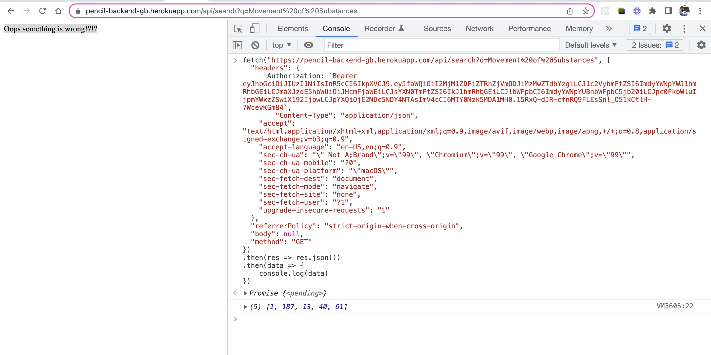
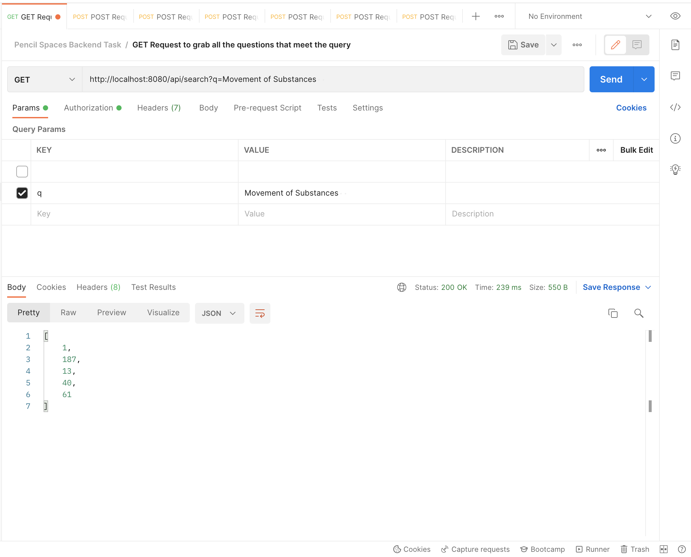
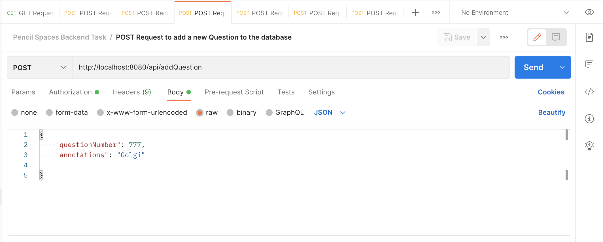
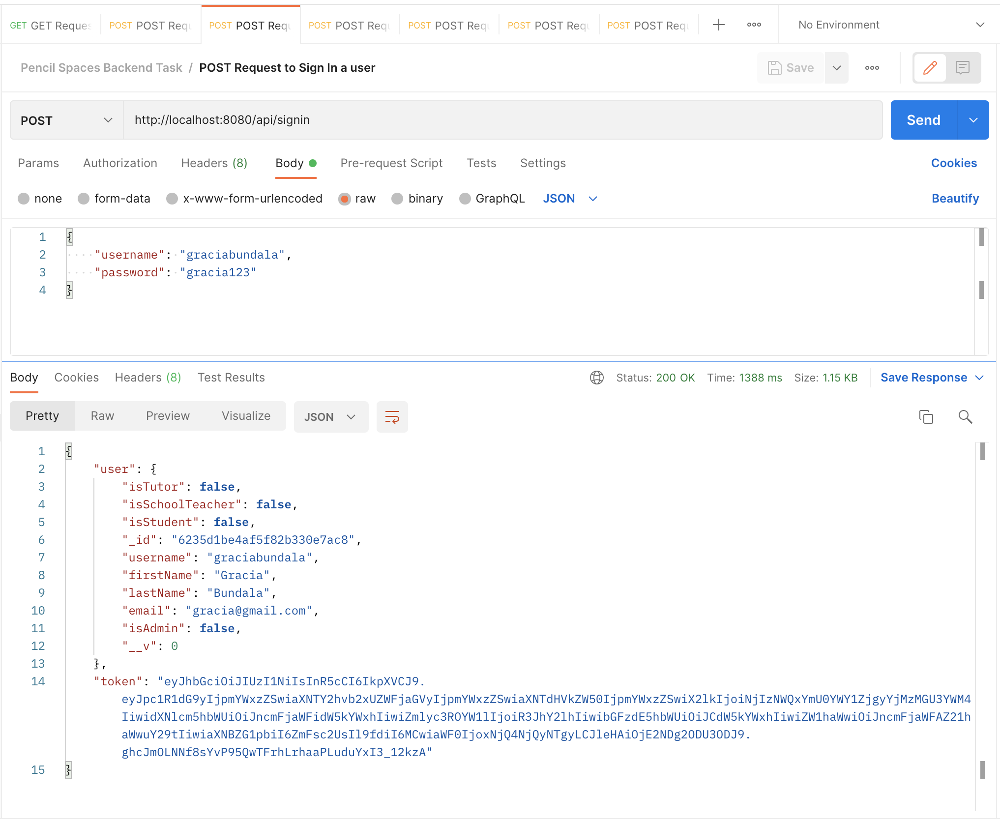
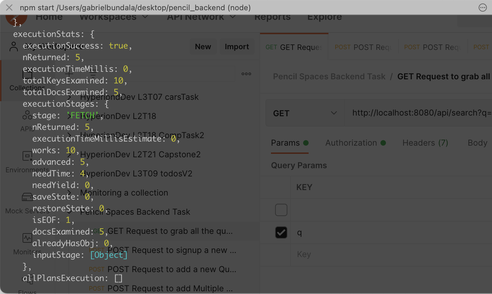
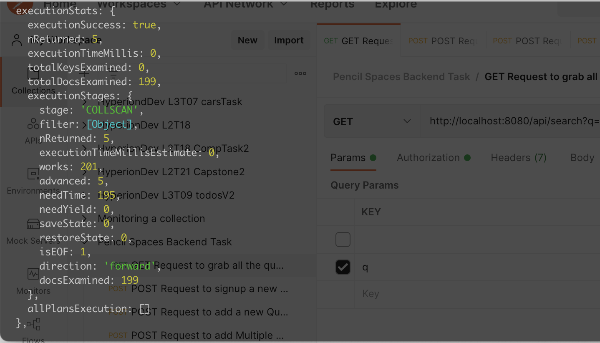

# Pencil Spaces Backend Task

## Table of Contents

1. Installing, testing and using the application
2. Backend part of the application
3. App security, Key & Credentials
4. Hosted on Heroku and Testing with Postman
5. Requirements of the Task

## Installation, testing and using the application

This application only includes the backend part created with ExpressJS a NodeJS library and MongoDB as the database layer.

If you need to see this application in action in development mode you can download the source files in your local environment then using your preferred terminal navigate to the root of the repository type and run **`npm install`** to install all the dependencies for the server. Then you can start the server with **`npm start`**. This command will run the nodemon script that will be restarting the server on each change you make in the code.

You may also clone the repo from https://github.com/gbundala/pencil_backend in your local environment or download the zip file from Github and follow the steps above.

If you need to see the application in action in Production, hosted on Heroku: https://pencil-backend-gb.herokuapp.com/

See below on how to make a request the section `Hosted on Heroku and Testing with Postman` to see how to test the application with some routes using the console in the browser in order to make the request to query for the questions. This is because we need to include the JWT Token in the request to successfully make the query.

## Backend part of the application

This RESTful API is created with Express.js, a popular Node.js library that simplifies the development of api with JavaScript.

The routes for the API have been developed in the `routes` directory (inside the `index.js` file).

Included in the backend code is the controller file and models file. The model file is used to define the `Schema` which provides the structure and design of how the data is store in the MongoDB database through the `mongoose` library.

The controller file defines all the business logic for handling the routes when an action triggered in the frontend hits one of the routes. All the actions in the database are handled in the controller file including creating and signing in the user and all the updates made to the user documents regarding the todo lists.

## App Security, Keys and Credentials

To ensure the security of this application, the Helmet library has been used to secure the application.

The MongoDB credentials and JWT keys are stores in **`.env`** file which is included in the `.gitignore` file hence not commited in Git to ensure security of the keys and credentials.

User passwords are hashed using the `bcrypt` library before
being stored in the database.

Scripts, libraries and dependencies used in the application as stored in the `package.json` file in the root directory, such as `npm test` and `npm start` scripts.

## Hosted on Heroku and Testing with Postman

The application is hosted on Heroku and the database in MongoDB Atlas.

In order to be able to make requests and queries you will need to send the JWT token along with the request. And in order to get the Auth Token you would need to sign up as a new user or login with email and password using `Postman`. Below are some example URLs you can make to test with Postman.

Link to the application on Heroku:
https://pencil-backend-gb.herokuapp.com/

The image below shows how to make a request through the console
and attach the token in the header of the request while in production

Testing with Postman. Below are some of the example requests that can be made using Postman to make requests to the API and test the URLs.

IMPORTANT: Make sure to include the `JWT auth token` for each of the requests. To be able to add a topic or question ensure that the `isAdmin` field is set to true for the user in order to successfully make such request

### GET Request to grab all the questions that meet the query

URL: http://localhost:8080/api/search?q=Movement%20of%20Substances

### POST Request to add a new Question to the database

URL: http://localhost:8080/api/addQuestion

### POST Request to Sign In a user

URL: http://localhost:8080/api/signin

## Requirements of the Task

Below are the details on how each of the requirements have been addressed for this Backend Task/Assignment.

Access Credentials to MongoDB have been shared through email.

### REQUIREMENT 1: Store all questions into the database

All the questions have been stored in the `questions` collection in MongoDB. An index has been created on the `annotations` field in the question documents. Refer to the documentation of the structure and architucture of the collection and the individual documents in the `model` and `controller` files.

Using an index has proved to provide significant improvement in the performance of the queries. MongoDB only checks a few documents

Queries made to the `questions` collection require that MongoDB make a `Collection Scan` through all the 199 question documents in the database (refer to the image below). While with indexes, the number of documents examined is only 5. This is great performance boost to the GET queries on the database.

### REQUIREMENT 2: Store all topics from the Topics Sheet into MongoDB

All the topics have been stored in the `topics` collection in MongoDB.

An index has been created on the `sub-topics` field in the `topics` collections to enable the fast retrieval of the sub-topics of a particular queried topic as this information is needed in order to make the query through the `questions` collections collection in order to ensure that all the questions relating to the topic and its sub-topics are returned.

Refer to the respective `topic.model.js` and `topics.controller.js` files for the detailed documentation of the architecture and structure of the documents as well as the design of how the queries and retrieval of the documents is imagined.

### REQUIREMENT 3 & 4: Create an API endpoint and Make sure your code is making efficient queries, regardless of which topic is queried

The denormalized design I have adopted for the database optimises for data reading/retrieval more than storage and posting of data.

This structure provides for making efficient queries regardless of what the level of the topic or sub-topic is, the same effort is made by MongoDB to fetch for the data. We have flattened out the structure of the documents in a denormalized manner such that the sub-topics for each topic are included in each of the individual topic documents.

### REQUIREMENT 5 & 6

The code/application is hosted on Heroku, refer to the respective section above for the link to Heroku and how to make a successful request ot the code with the respective auth tokens.

The code is also uploaded on Github as shared in the email. Refer to the above part on testing with Postman to see the example Request URLs and responses.

> Thank you!
